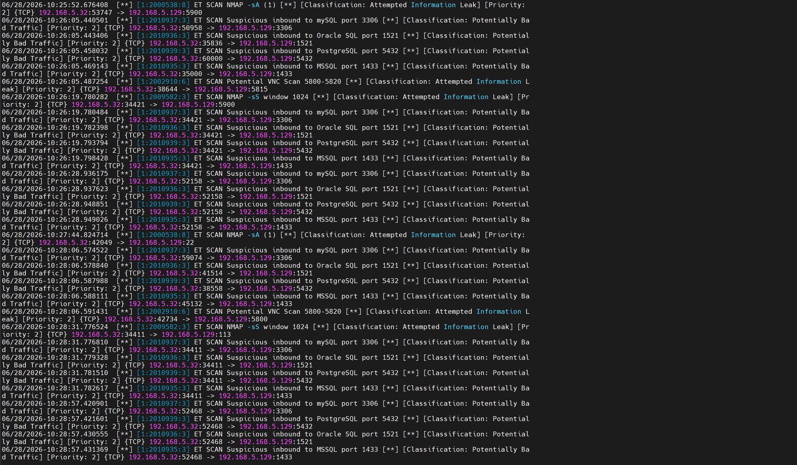
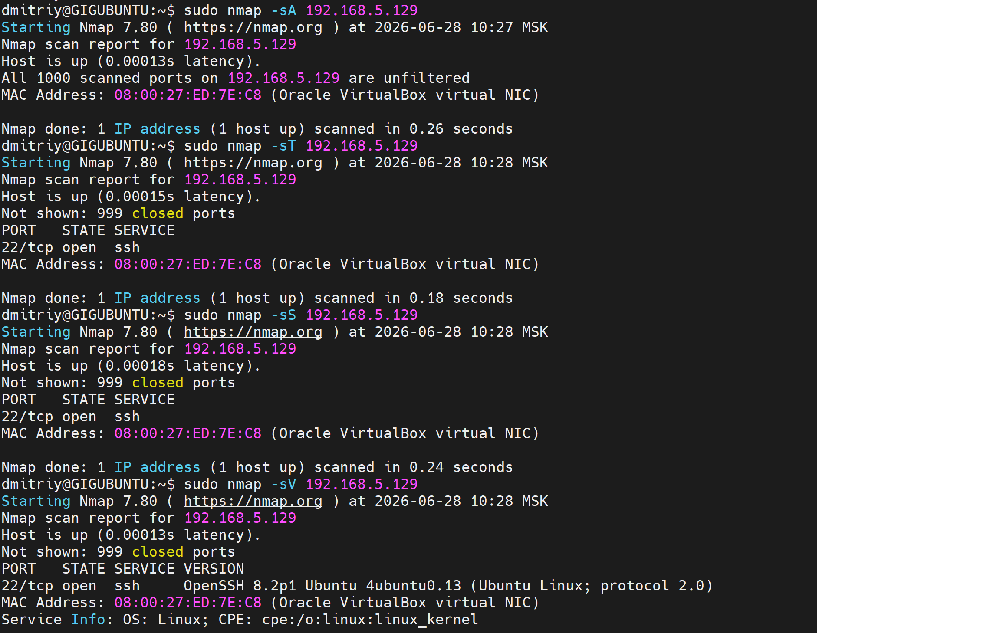
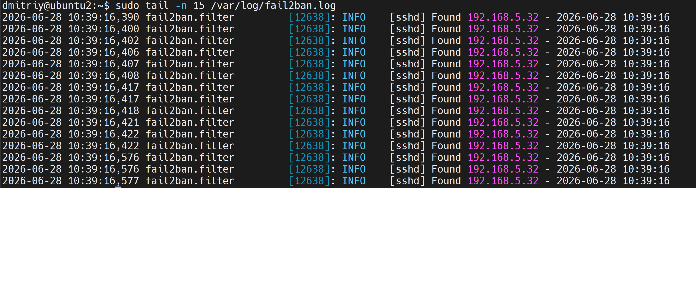
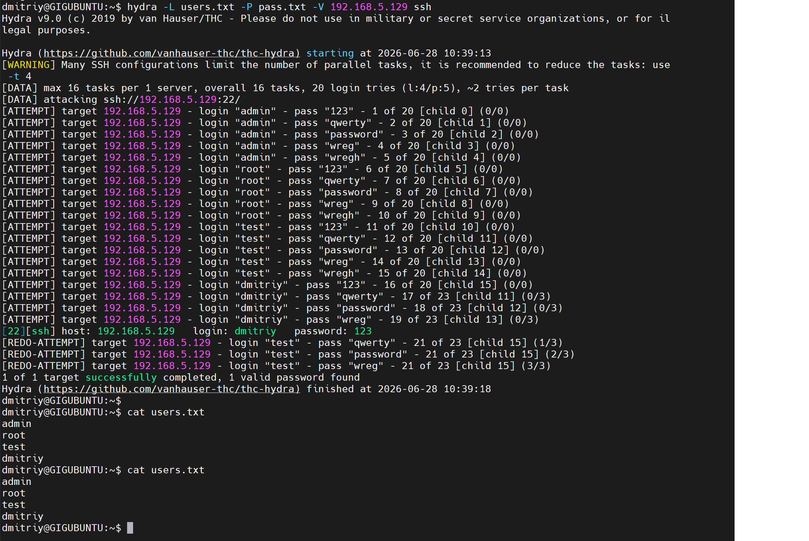
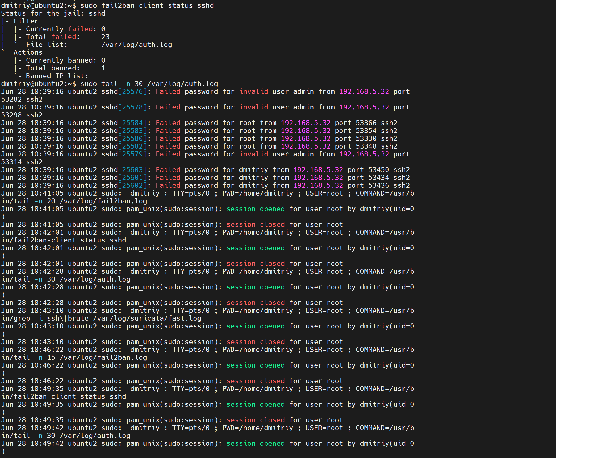
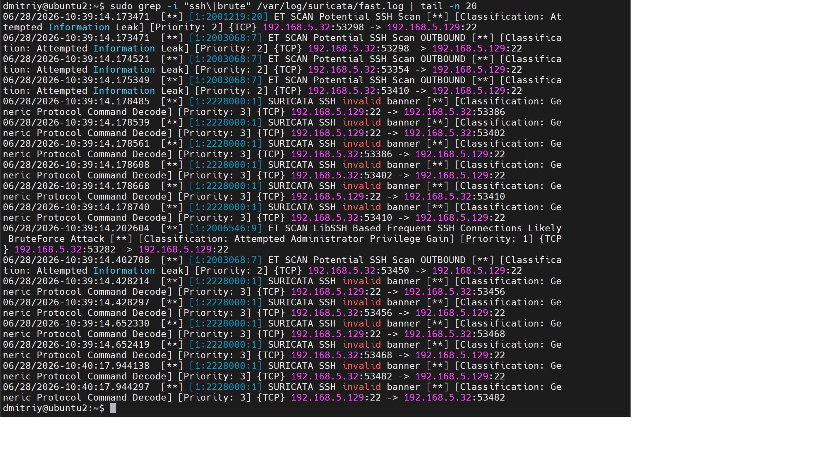

# Защита сети

## Задание 1. 

sudo nmap -sA 192.168.5.129
sudo nmap -sT 192.168.5.129
sudo nmap -sS 192.168.5.129
sudo nmap -sV 192.168.5.129

### Вывод команд nmap

На скрине показаны результаты всех четырёх сканирований:
- `-sA` (ACK scan) — все 1000 портов помечены как `unfiltered`, ACK-скан не определяет состояние порта (open/closed), а только проверяет наличие фильтрации файрволом.
- `-sT` (TCP connect scan) и `-sS` (SYN scan) дали идентичный результат — единственный открытый порт `22/tcp` (SSH).
- `-sV` дополнительно определила версию службы: `OpenSSH 8.2p1 Ubuntu 4ubuntu0.13`, а также ОС — Linux.

**Fail2Ban** на этапе разведки не зафиксировал никаких событий — лог `/var/log/fail2ban.log` оставался пустым (счётчики `Currently failed: 0`, `Currently banned: 0`).
Это объясняется архитектурой инструмента: Fail2Ban анализирует лог аутентификации (`/var/log/auth.log`) и реагирует только на неудачные попытки входа,
а сканирование портов nmap не предполагает передачи логина/пароля — соединение либо устанавливается, либо нет, но аутентификация не происходит.
Таким образом, на этапе разведки обнаружение полностью лежит на сетевом IDS-уровне (Suricata).

---

## Задание 2. 

Hydra перебрала 20 комбинаций логин/пароль (4 логина × 5 паролей) за ~5 секунд при стандартных 16 потоках и нашла рабочую пару:
[22][ssh] host: 192.168.5.129   login: dmitriy   password: 123

Видны также строки `[REDO-ATTEMPT]` — повторные попытки, которые начали обрываться из-за срабатывания блокировки Fail2Ban в процессе атаки.

### Логи Fail2Ban и auth.log

`sudo tail -n 30 /var/log/auth.log` показывает построчно процесс брутфорса:
Failed password for invalid user admin from 192.168.5.32 ...

Failed password for invalid user test from 192.168.5.32 ...

Failed password for root from 192.168.5.32 ...

Failed password for dmitriy from 192.168.5.32 ...
а также следы успешной сессии (`session opened`/`session closed for user dmitriy`), соответствующей найденной валидной паре.

Fail2Ban зафиксировал 23 неудачные попытки аутентификации и заблокировал атакующий IP (`192.168.5.32`) — запись 
`[sshd] Ban 192.168.5.32` появилась всего через 2 секунды после старта атаки, то есть ещё до завершения перебора всего словаря hydra.

Suricata обнаружила атаку на сетевом уровне сразу несколькими типами сигнатур:

- `ET SCAN Potential SSH Scan` / `ET SCAN Potential SSH Scan OUTBOUND` — детектирование множественных подключений к порту 22 за короткий промежуток времени;
- **`ET SCAN LibSSH Based Frequent SSH Connections Likely BruteForce Attack`** (Priority: 1, классификация `Attempted Administrator Privilege Gain`) - специализированное правило,
напрямую идентифицирующее паттерн брутфорс-атаки именно по частоте SSH-подключений;
- `SURICATA SSH invalid banner` — протокольная аномалия, связанная с тем, что hydra использует библиотеку libssh для подключения, чей SSH-banner отличается от штатного OpenSSH-клиента.

- **Suricata** работает на сетевом уровне и детектирует подозрительные паттерны трафика практически в реальном времени — как на этапе разведки
(распознавание типов nmap-сканирования по сигнатурам пакетов), так и на этапе атаки (распознавание брутфорса по частоте SSH-сессий), независимо от того, успешна ли сама атака.
- **Fail2Ban** работает на уровне логов приложения (SSH/PAM) и реагирует только на сам факт неудачных попыток авторизации, поэтому он "слеп" к разведке (сканированию портов),
 но эффективен против брутфорса - автоматически блокирует источник атаки после превышения порога неудачных попыток.
- Совместное использование обоих механизмов перекрывает разные фазы атаки: Suricata реагирует на оба этапа (разведка + брутфорс),
 Fail2Ban - только на этап брутфорса, но даёт активный ответ (блокировку), а не только уведомление.
